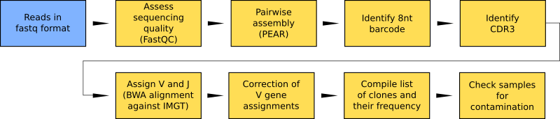

Welcome to RESEDA's documentation!
==================================

REpertoire SEquencing Data Analysis

Data analysis workflow for T- and B-cell receptor repertoire sequencing.
The workflow identifies clones and their frequency from next generation
sequencing of repertoires and includes steps for quality control and bias
correction.

Running the software on one machine
-----------------------------------

Read the following sections for running the software on one machine:

* Requirements
* Prepare input files
* Run standalone

Running the software on multiple machines
-----------------------------------------

RESEDA can run on multiple machines (such as a cloud system) using the ToPoS pilot
job framework (surfsara.nl) and a job monitoring tool. The input and output data
is stored on a webdav server in that case. Read these pages for instructions:

* Requirements
* Settings
* Prepare input files
* Run with ToPoS

.. include:: contents.rst
